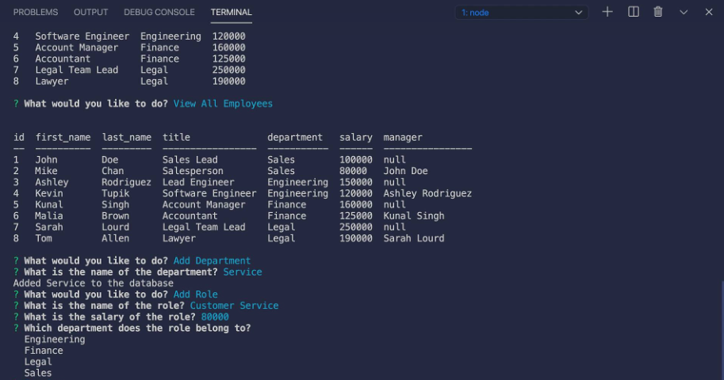

# employee-tracker
  by allstarcoding777
  
  * ## Description
  This command-line application allows a user to manage and navigate through a company's employee database.
  * ## Usage
  Open code in terminal. Type node index.js to begin running application.
  
  
  
  * ## Demo
  Check out my demonstration of this app [HERE](https://drive.google.com/)
  * ## Github Repository
  https://github.com/allstarcoding777/employee-tracker
  * ## License
  This project is licensed under the MIT license.